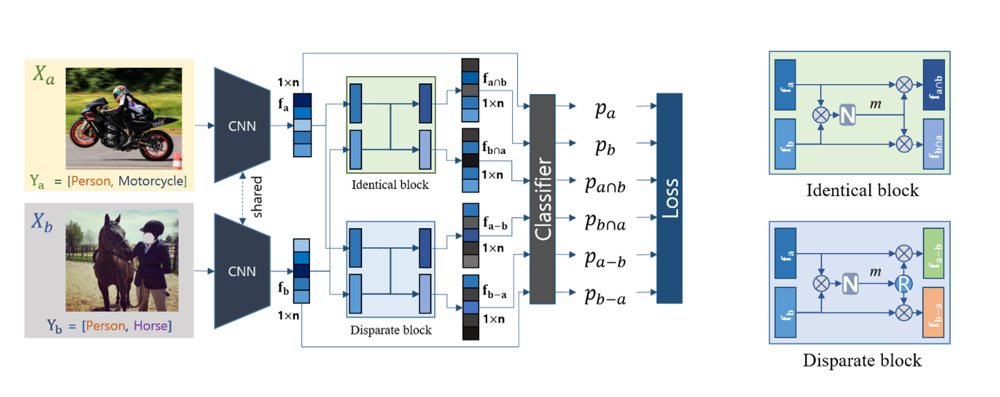
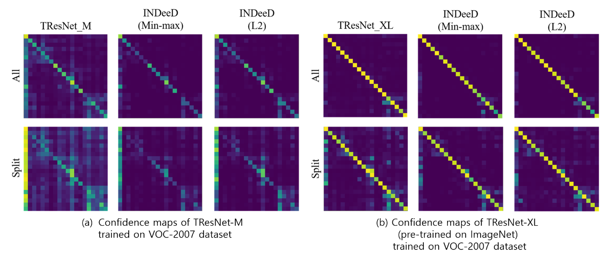
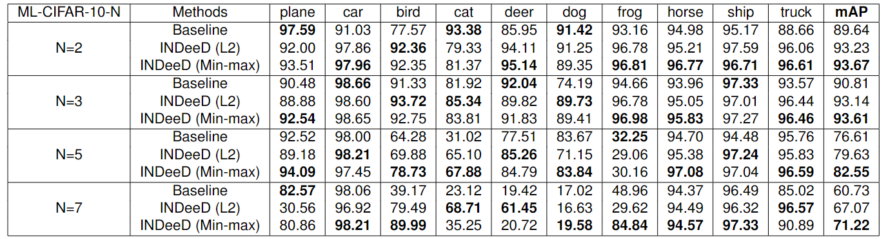
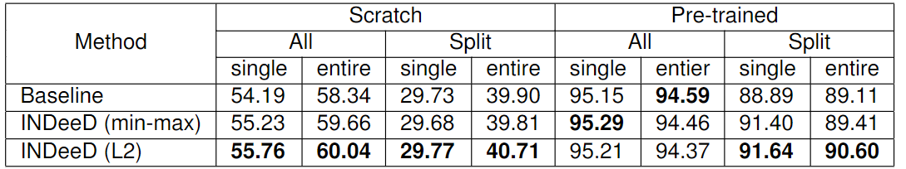
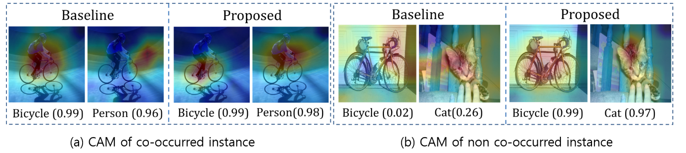

Tserendorj Adiya and Seungkyu Lee

Kyung Hee University.

<h3>Abstract</h3>

Deep learning technology has made a significant improvement in image recognition performance. Unlike single-labeled  training and inference, multi-labeled classification tasks hardly  characterize individual label in the training of deep neural networks due to co-occurrence of the labels. Training data contains  few samples of separated single label and the networks learn  diverse compositions of labels from the data. Contextual bias  caused by the co-occurrence of labels disturbs multi-label clas-  sification. We propose Identical and Disparate Feature Decomposition (INDeeD) from multi-label data that explicitly learn the  characteristics of individual label. By training a backbone net-  work combined with Identical and Disparate blocks on the in-  stance pairs of partially common and contrastable labels, the net-  work is generalized to decompose and learn individual label fea-  tures. Proposed INDeeD scheme can be simply incorporated in  any type of networks. We use ML-MNIST, ML-CIFAR-10, VOC-2007, and MS-COCO datasets to evaluate the performance of INDeeD showing improved mAP over baseline.

<h3>Overview</h3>

(rigth) Overall diagram of proposed method: fa∩b, fb∩a, fa−b and fb−a features are extracted by Identical and Disparate blocks
from features fa and fb of input images Xa, Xb. Classification is conducted based on the six feature vectors. (left) Detailed structure of
Identical and Disparate blocks: ⊗ stands for element-wise product and N indicates normalization. L2 norm or min-max is used as N. R indicates (1-m)

<h3>Comparison</h3>

Confidence maps of the tests on ML-MNIST and ML-CIFAR-10 data sets: Vertical axis of confidence map corresponds to label
index of test data. Horizontal-axis is average output probability value of corresponding test instances of vertical-axis.

ML-MNIST test results of Baseline(simple CNN) and INDeeD normalized by min-max and L2 and evaluated by average
precision (AP) and mean of AP (mAP).

ML-CIFAR-10 test results of Baseline(VGG-16) and INDeeD normalized by min-max and L2 and evaluated by average precision
(AP) and mean of AP (mAP).

Class activation maps of INDeeD and Baseline: INDeeD CAM shows better localization and higher confidence scores.

<h3>Bibtex</h3>

    @inproceedings{ 
    

        adiya2022indeed,,  
        title={INDeeD: Identical and disparate feature decomposition from multi-label data}, 
        author={Adiya, Tserendorj and Lee, Seungkyu}, 
        booktitle={IS and T International Symposium on Electronic Imaging Science and Technology}, 
        volume={34}, 
        number={11}, 
        pages={189}, 
        year={2022} 
    

    }

