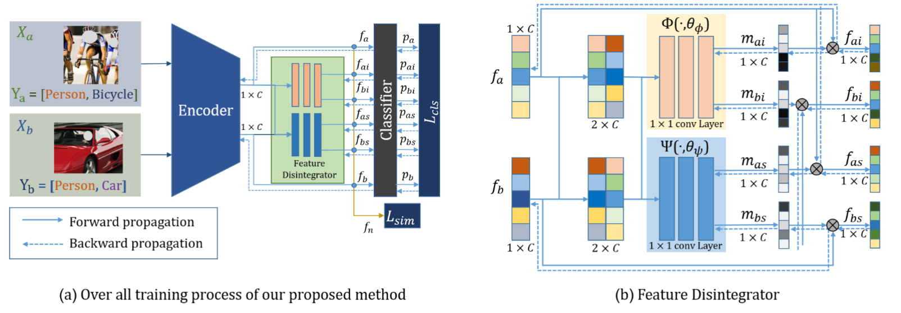
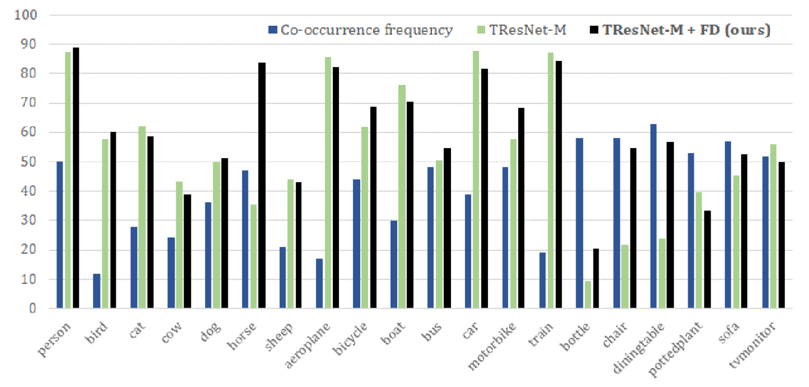
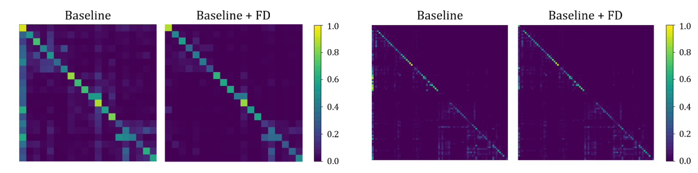
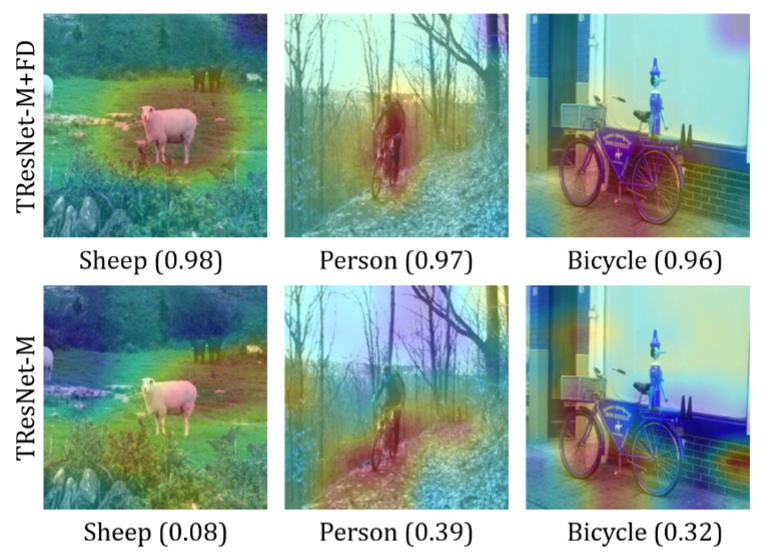
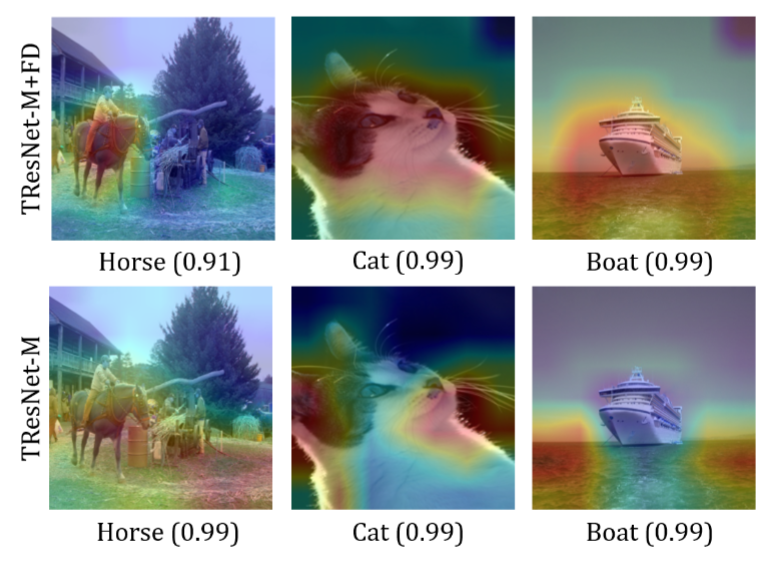

Tserendorj Adiya and Seungkyu Lee

Kyung Hee University.

A multi-label data contains {person}, {cup}, and {bag} categories. When the multi-label training data
composition is {person, cup} or {person, bag}, our proposed Feature Disintegrator decomposes the {person}, {cup}, and {bag} individual category features.

<h3>Abstract</h3>

Image recognition is a popular and important research field of computer vision. Recently with the development of deep learning technology, image recognition performance has been improved  significantly. However with multi-label images, recognizing individual category is a challenging task. In  order to address the problem, we propose a Feature Disintegrator (FD) that decomposes co-occurred instance  features of multi-label into individual categories. In experimental evaluation, proposed method achieves the  gains of mean average precision (mAP) up to 18.67% and 29.05% over baseline networks in ML-MNIST  and ML-CIFAR, respectively. It shows 5.76% and 6.65% higher mAP than baseline on PASCAL VOC-2007 and MS-COCO data set respectively.

<h3>Overview</h3>

The illustration of over all training process and structure of our proposed Feature Disintegrator. Where Lcls and
Lsim are the loss functions

<h3>Comparison</h3>

Label co-occurrence frequency (in %) of each category of VOC-2007 training set and average precision scores (in
%) of TResNet-M and TResNet-M+FD(ours).

Single class confidence map comparison.

    

        
    

    

        
    

Class activation map (CAM) comparison.

<h3>Bibtex</h3>

    @article{ 
    

        adiya2021learning,  
        title={Learning Individual Class Representation From Biased Multi-Label Data}, 
        author={Adiya, Tserendorj and Lee, Seungkyu}, 
        journal={IEEE Access}, 
        volume={9}, 
        pages={99504--99512}, 
        year={2021}, 
        publisher={IEEE} 
    

    }

