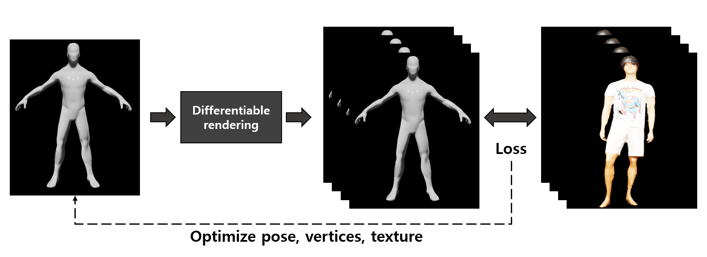

<!-- 
Tserendorj Adiya and Seungkyu Lee

Kyung Hee University.
 -->

<h3>About Project</h3>

I developed an algorithm to generate 3D rigged mesh models through multi-view images. I implemented a method to optimize the pose, texture, and shape of the rigged base model through differentiable rendering. Constraints on joint distance and angle were set for stable pose optimization.

To optimize high-quality texture, I normalized to maximize the face area of the unwrapped UV map. I also set a Laplacian constraint to optimize the surface in a stable and smooth manner.

As a result, I generated a precise 3D human model with rigging, reducing the time spent on modeling by 80% compared to manual work.

<h3>Overview</h3>

Optimize the pose, shape, and texture of the human model using Differentiable Rendering.

Constraints for stable optimization.
