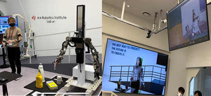

<!-- 
Tserendorj Adiya and Seungkyu Lee

Kyung Hee University.
 -->

<h3>About Project</h3>

I have developed a system to simulate a humanoid robot and digital human for interaction between robots and humans in real time. For real-time simulation of the robot, digital human, and other 3D environments, I used Omniverse IsaacSim.

For creating the digital human, I used volumetric capture to film humans in advance and generate 3D models. The robot was built using URDF. The physics simulation was developed using the Omniverse library. ZeroMQ was used for real-time communication between the robot, XSense sensors, and the simulator.

With this simulation environment, I have successfully completed the KIST OpenLab digital twin demo of a humanoid robot.

<h3>Related Articles</h3>

  <iframe width="560" height="315" src="https://www.youtube.com/embed/DqTy5j51IWw?start=53" frameborder="0" allow="accelerometer; autoplay; clipboard-write; encrypted-media; gyroscope; picture-in-picture" allowfullscreen></iframe>

News: <a href="https://www.aitimes.kr/news/articleView.html?idxno=26483">KIST 인공지능·로봇 연구소, 미리 보는 미래...'AI x Robot '오픈랩 개최</a>

