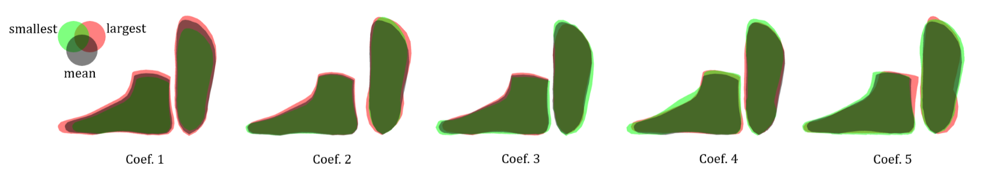

Tserendorj Adiya, Sanghun Kim, Soomin Kim and Hwasup Lim

Korea Institude of Science and Technology.

<iframe width="560" height="315" src="https://www.youtube.com/watch?v=dU3-yYvw2ZA" frameborder="0" allow="accelerometer; autoplay; clipboard-write; encrypted-media; gyroscope; picture-in-picture" allowfullscreen></iframe>

<h3>Abstract</h3>
Accurately measuring feet is essential in clothing, sports, and medical fields, but it’s challenging due to the human body’s flexible muscles and various joint positions. While experts and automatic systems offer greater precision, they can be expensive, computationally demanding, and inaccessible. In this paper, we present an efficient foot reconstruction and measurement algorithm from few view images that utilizes deep learning and optimization-based components. The proposed method comprises three components: Segmentation, 3D foot reconstruction, and Measurement. The segmentation component uses a deep learning network for estimating coarse geometry, and a synthetic dataset is generated to train the segmentation network. A preprocessing method is proposed to simplify the context and improve segmentation performance. The 3D foot reconstruction component utilizes a foot model with probabilistic properties, called the flexible-density model. This model permits the modification of source point density, which in turn enables the estimation of foot shape in a more unrestricted manner. An optimal source point distribution method is proposed to optimize the estimation of foot shape using the flexible-density model. The measurement component proposes exploiting an optimal number of corresponding points for computationally efficient optimization. Our foot measurement algorithm can achieve higher measurement accuracy compared to prior works.

<h3>Overview</h3>

Overview of our proposed foot reconstruction and measurement. Segmentation Network: a deep learning network for segmenting the foot. 3D Foot
Reconstruction: multi-view reconstruction and PCA-based flexible-density model for estimating the actual foot shape. Measurement: measures the values of various
parts with pre-designated landmark.

Change of deformation in M when one of the coefficients of p is varied while others are zero. Green and red colors indicate the smallest and largest coefficient
respectively.
