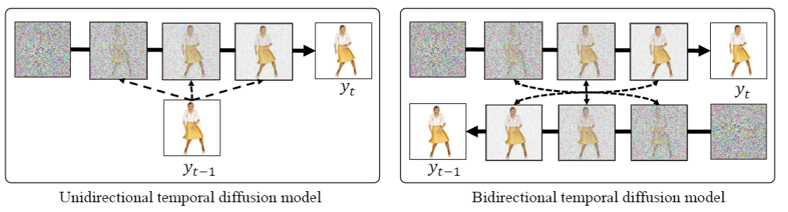

Tserendorj Adiya, Sanghun Kim1, Jung Eun Lee1, Jea Shin Yoon2 and Hwasup Lim1

1Korea Institude of Science and Technology, 2Adobe.

<h3>Abstract</h3>

We introduce a method to generate temporally coherent human animation from a single image, a video, or a random noise. This problem has been formulated as modeling of an auto-regressive generation, i.e., to regress past frames to decode future frames. However, such unidirectional generation is highly prone to motion drifting over time, generating unrealistic human animation with significant artifacts such as appearance distortion. We claim that bidirectional temporal modeling enforces temporal coherence on a generative network by largely suppressing the motion ambiguity of human appearance. To prove our claim, we design a novel human animation framework using a denoising diffusion model: a neural network learns to generate the image of a person by denoising temporal Gaussian noises whose intermediate results are cross-conditioned bidirectionally between consec utive frames. In the experiments, our method demonstrates strong performance compared to existing unidirectional approaches with realistic temporal coherence.

<h3>Overview</h3>

Our bidirectional temporal diffusion model (BTDM) where the intermediate results are recursively cross-conditioned on consecutive frames at every denoising step.

<h3>Comparison</h3>

We compare BTDM to state-of-the-art image-to-animation methods: "Motion Representations for Articulated Animation" (Siarohin et al. 2021) and "Thin-Plate Spline Motion Model" (Zhao et al. 2022).
<!-- 

 -->
 
 

Comparison on UBC Fashion dataset

 
 

Comparison on Graphic Simulated dataset

 
 
We compare BTDM to state-of-the-art video-to-animation methods: "Video-to-video synthesis" (Wang et al. 2018), "Everybody dance now" (Chan et al. 2019), "High-fidelity neural human
motion transfer from monocular video" (Kappel et al. 2021), "Dance in the wild" (Wang et al. 2021) and "Learning motion-dependent appearance for high-fidelity rendering of dynamic
humans from a single camera" (Yoon et al. 2022)

 
 
 
 
Here we show few generated animation from noise.

 
 
<h3>Ablation Study</h3>

We compare unidirectional and bidirectional model

We show effective of Recursive Sampling method for generating animation.

Comparison of number of images used for fine-tuning

<h3>Bibtex</h3>

    @article{ 
    

        adiya2023bidirectional,  
        title={Bidirectional Temporal Diffusion Model for Temporally Consistent Human Animation}, 
        author={Tserendorj Adiya, Sanghun Kim, Jung Eun Lee, Jea Shin Yoon and Hwasup Lim}, 
        booktitle={arXiv preprint arxiv:2306.09329}, 
        year={2023} 
    

    }

